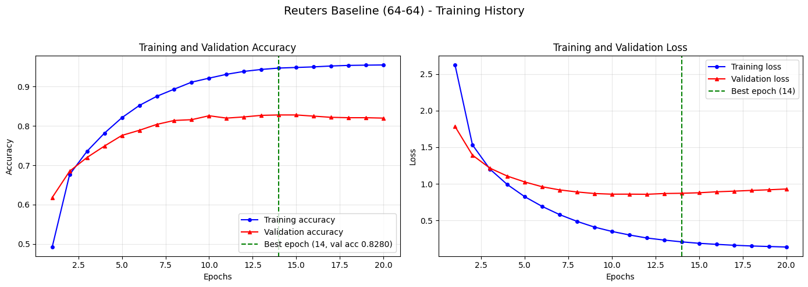
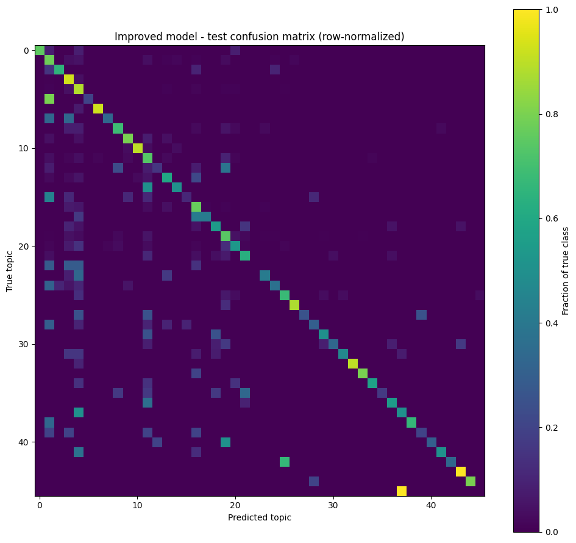
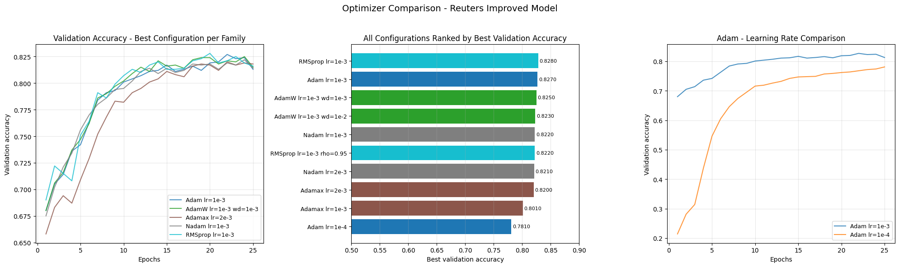

# Reuters Newswire Topic Classification

Multi-class text classification on the Reuters dataset bundled with Keras: 8,982 training and 2,246 test newswires across 46 topics, encoded as multi-hot vectors over the 10,000 most frequent words. The starting point is the classic fully connected network from Chollet's *Deep Learning with Python* (ch. 3.5); the project takes it through a disciplined train/select/evaluate workflow, an architecture comparison against a classical baseline, and an optimizer study.

The dataset is heavily imbalanced (two topics cover 57% of the test set), so results are reported as both accuracy and macro-F1, against majority-class (36.2%) and shuffled-label (18.2%) reference baselines.

## Layout

```
1/
├── reuters_common.py     # shared data pipeline, model builders, metrics, plots
├── part-1/               # baseline model, epoch selection on validation
├── part-2/               # improved architecture vs classical baseline
├── part-3/               # optimizer comparison
└── archived/             # superseded originals + Chollet reference notebook
```

Each part is a standalone script that writes `part-N_output.txt` (full metrics, library versions, seed) and its plots next to itself.

## How to run

```bash
python3.12 -m venv venv   # from the repo root; 3.12 for TensorFlow wheel support
./venv/bin/pip install tensorflow keras scikit-learn matplotlib
./venv/bin/python 1/part-1/part-1.py
./venv/bin/python 1/part-2/part-2.py
./venv/bin/python 1/part-3/part-3.py
```

Everything is seeded (42); a full re-run takes about 10 minutes on CPU.

## Evaluation protocol

Model and epoch selection use the validation set (the first 1,000 training samples) exclusively. The test set is touched once per part, by the single selected model. Part 3 trains ten configurations but evaluates only the validation winner on test — ranking many configurations by their test scores quietly turns the test set into a second validation set, so the original version of that experiment was corrected.

## Part 1 — Baseline and epoch selection

The reference network (Dense 64-64, rmsprop) is trained for 20 epochs to locate the overfitting point, then retrained from scratch for the selected epoch count.

| | |
|---|---|
| Best epoch (by validation accuracy) | 14 (val acc 0.828) |
| Test accuracy | **0.798** |
| Test macro-F1 | 0.537 |
| Majority-class / shuffled baselines | 0.362 / 0.182 |



The accuracy and loss curves diverge after epoch ~14: training accuracy keeps climbing toward 95% while validation plateaus — the textbook overfitting signature that motivates early stopping in parts 2 and 3.

## Part 2 — Architecture vs a classical baseline

A wider funnel network (256-128-64 with batch normalization and progressive dropout 0.4/0.3/0.2, Adam) against two controls trained on identical splits: the part-1 baseline re-run with the same early stopping, and TF-IDF + logistic regression.

| Model | Val acc | Test acc | Macro-F1 | Fit time |
|---|---|---|---|---|
| Baseline MLP (64-64) | 0.833 | 0.801 | 0.561 | 1.9 s |
| Improved MLP (256-128-64 + BN) | 0.822 | **0.803** | **0.576** | 7.4 s |
| TF-IDF + LogisticRegression | 0.816 | 0.786 | 0.405 | 1.9 s |



The row-normalized confusion matrix shows errors flowing into the two dominant topics; several single-digit-support classes never get predicted at all, which is why macro-F1 sits ~22 points below accuracy for the neural models and ~38 for the linear one.

## Part 3 — Optimizer comparison

Ten configurations across five optimizer families (RMSprop, Adam, AdamW, Adamax, Nadam; two hyperparameter settings each) on the part-2 architecture, identical seed and early stopping.

| Rank | Configuration | Best val acc |
|---|---|---|
| 1 | RMSprop lr=1e-3 | 0.828 |
| 2 | Adam lr=1e-3 | 0.827 |
| 3 | AdamW lr=1e-3 wd=1e-3 | 0.825 |
| ... | (all lr≈1e-3 configs) | 0.820–0.828 |
| 9 | Adamax lr=1e-3 | 0.801 |
| 10 | Adam lr=1e-4 | 0.781 |

Winner on the single test evaluation: **RMSprop lr=1e-3 — test accuracy 0.802, macro-F1 0.592.**



## Findings

1. **The representation is the ceiling, not the classifier.** Multi-hot bag-of-words caps everything near 80% test accuracy: a 2-layer MLP, a 3-layer batch-norm network, ten optimizer variants, and a linear TF-IDF model all land within ~2 points of each other.
2. **With early stopping, the small baseline matches the bigger network.** The 256-128-64 architecture trains more smoothly and edges ahead on macro-F1, but buys essentially no accuracy. Capacity was not the bottleneck.
3. **Learning rate matters more than optimizer family.** Eight configurations at lr≈1e-3 span 0.8 points of validation accuracy; dropping Adam to lr=1e-4 costs 4.6 points — a larger effect than any family swap.
4. **Accuracy flatters an imbalanced problem.** Macro-F1 (0.54–0.59) tells the truer story: rare topics are mostly sacrificed, and the regularized linear model sacrifices them hardest.
5. **A classical baseline is two lines and two seconds.** TF-IDF + logistic regression reaches 78.6% — within 1.7 points of the best deep model here. Worth running before reaching for anything deeper.

## Limitations and next steps

The multi-hot encoding discards word order and frequency; the obvious next rungs are TF-IDF inputs for the MLP, learned embeddings with a sequence model, and a fine-tuned pretrained transformer, in that order of cost. Class imbalance could be attacked directly with class weights or focal loss if rare-topic recall mattered. None are implemented here on purpose — this project is about getting the fundamentals and the evaluation discipline right.

## Provenance

The starting architecture and data protocol follow Chollet, *Deep Learning with Python*, ch. 3.5; the original example notebook is kept verbatim at `archived/chollet-3.5-reference.ipynb`. All code in `reuters_common.py` and the part scripts targets Keras 3.
