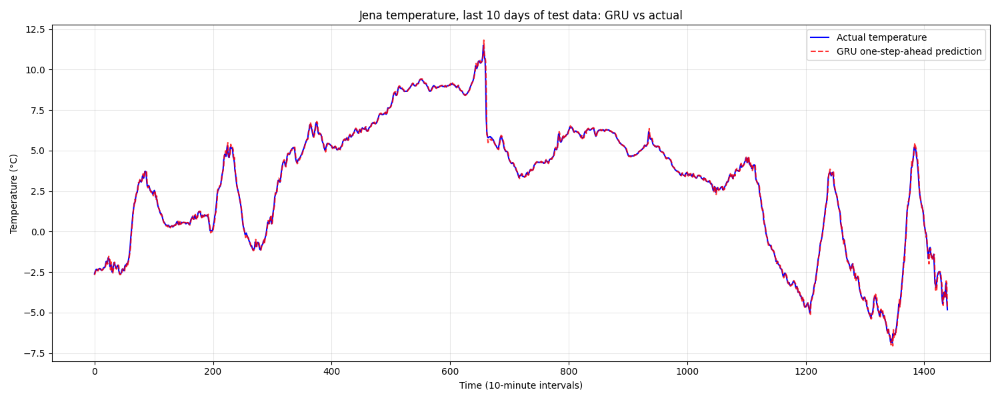
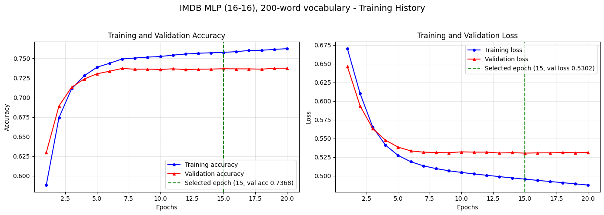
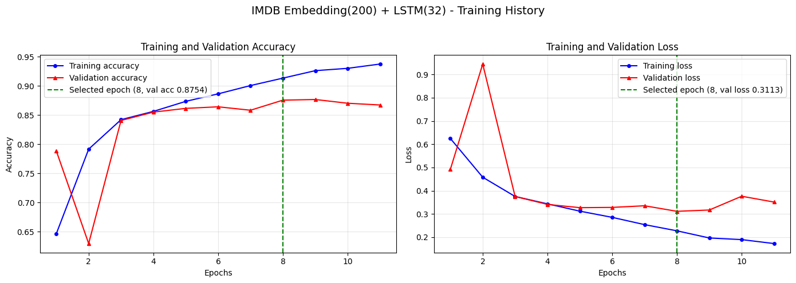

# Sequence Models: Temperature Forecasting and IMDB Sentiment

Three experiments spanning RNN regression and text classification. Part 1 trains a GRU one-step-ahead forecaster on the Jena climate temperature series (420,551 ten-minute readings, 2009-2016) and scores it against the baseline every forecasting claim should clear: persistence. Parts 2 and 3 work the IMDB sentiment task (25,000 balanced train and test reviews) from two directions — a bag-of-words MLP deliberately starved down to a 200-word vocabulary, and an Embedding + LSTM sequence model. The starting points are the classic networks from Chollet's *Deep Learning with Python*; each is taken through a fixed train/select/evaluate protocol with measured (not cited) reference models.

## Layout

```
projects/2/
├── imdb_common.py    # shared IMDB pipeline, model builders, metrics, plots (parts 2-3)
├── part-1/           # GRU temperature forecasting vs persistence
├── part-2/           # 200-word bag-of-words MLP vs measured references
├── part-3/           # Embedding + LSTM sequence model
└── archived/         # superseded originals + Chollet reference notebook
```

Each part is a standalone script that writes `part-N_output.txt` (full metrics, library versions, seed) and its plots next to itself.

## How to run

```bash
python3.12 -m venv venv   # from the repo root; 3.12 for TensorFlow wheel support
./venv/bin/pip install tensorflow keras scikit-learn pandas matplotlib
./venv/bin/python projects/2/part-1/part-1.py   # fetches the Jena CSV (~41 MB) on first run
./venv/bin/python projects/2/part-2/part-2.py
./venv/bin/python projects/2/part-3/part-3.py
```

Everything is seeded (42); a full re-run takes about ten minutes on CPU.

## Evaluation protocol

Epoch selection uses validation data only — the first 10,000 training reviews for IMDB, the temporal tail 10% of training windows for Jena. Every test set is touched exactly once, by the single selected model. Where the original version of this project cited a reference number ("the 10,000-word model gets ~88%"), the rewrite trains that reference under the identical protocol and reports what it actually scores.

## Part 1 — GRU forecasting vs persistence

One-step-ahead prediction of `T (degC)` from a 60-step (10-hour) lookback window, with the last 1,440 observations (10 days) held out as the test window. GRU(50) → Dense(1), 8,001 parameters, scaling fit on training data only. The persistent forecast — predict the previous observation — is computed on the identical 1,440 targets.

| Model (units: °C) | MSE | RMSE | MAE |
|---|---|---|---|
| GRU one-step-ahead | **0.0217** | **0.147** | **0.092** |
| Persistent forecast | 0.0341 | 0.185 | 0.116 |



The GRU improves MSE by 36.3%, but the absolute scale deserves honesty: at 10-minute resolution temperature barely moves, so persistence is already accurate to 0.12 °C MAE. The GRU's edge means it has learned short-horizon momentum beyond copy-forward — visible in the plot where predictions hug turning points — not that forecasting weather is solved.

## Part 2 — How much vocabulary does sentiment need?

The Chollet Dense 16-16-1 classifier on multi-hot vectors, with the vocabulary cut from 10,000 to the 200 most frequent words. Protocol for both vocabularies: 20-epoch exploratory run, select the epoch with minimum validation loss, retrain from scratch on all 25,000 reviews, evaluate once on test. Two measured references: the same architecture at 10,000 words, and TF-IDF + logistic regression capped at the same 200 words.

| Model | Vocab | Best epoch | Val acc | Test acc |
|---|---|---|---|---|
| MLP 16-16 | 200 | 15 | 0.737 | 0.742 |
| MLP 16-16 | 10,000 | 4 | 0.888 | **0.884** |
| TF-IDF + LogisticRegression | 200 | — | 0.760 | 0.759 |
| Majority class | — | — | — | 0.500 |



Two percent of the vocabulary retains 84% of the accuracy. The curves show why the 200-word model stalls: validation accuracy is flat from epoch 7 while training accuracy keeps creeping — the representation, not the network, is the ceiling. The sharper result is the classical baseline: at 200 words, TF-IDF + logistic regression *beats* the MLP by 1.7 points, because TF-IDF keeps term frequencies while the multi-hot encoding collapses every review to word presence. When the representation is starved, what you feed the model matters more than what the model is.

## Part 3 — Embedding + LSTM sequence model

Reviews padded to 500 indices over the 10,000-word vocabulary, embedded into 200-dimensional vectors (the spec fixes the LSTM input at shape `(samples, 500, 200)`), then LSTM(32) → sigmoid: 2,029,857 parameters. Early stopping on validation loss (patience 3, best weights restored) ended training at epoch 11; the epoch-8 weights were evaluated once on test.

| | |
|---|---|
| Best epoch (by validation loss) | 8 (val acc 0.875) |
| Test accuracy | **0.871** |
| Test loss | 0.319 |
| Spec target ≥ 0.75 | achieved |



## Findings

1. **Measure the naive baseline first.** Persistence (temperature) and majority class (sentiment) anchor every other number here. Without them, "MSE 0.0217" and "87% accuracy" are unfalsifiable applause lines.
2. **Vocabulary size moves IMDB accuracy more than model choice.** Going from 200 to 10,000 words is worth +14 points; every modeling decision in this project (MLP vs logistic regression vs LSTM) moves at most 2.
3. **Order information didn't pay for itself.** The 2.03M-parameter LSTM reading word order scores 87.1%; the 160k-parameter bag-of-words MLP scores 88.4%. For coarse binary sentiment, word presence carries nearly all the signal — the known result, reproduced rather than assumed.
4. **Representation beats capacity when inputs are starved.** At 200 words, keeping frequencies (TF-IDF + logistic regression) outperforms a deeper model fed binary presence.
5. **Padding is a place answers go wrong.** With pre-padding, `x_train[0][0]` is the pad token (the first review has 218 words, so 282 leading zeros), not "the first word of the review" as the original write-up claimed. The LSTM also burns 282 steps per such review walking pads it was never told to ignore — `mask_zero=True` is the first improvement this project deliberately leaves on the table.

## Limitations and next steps

Part 1 is univariate and one-step-ahead; the natural next rungs are the multivariate features the Jena CSV already carries (pressure, humidity), multi-step horizons, and walk-forward validation instead of a single split. The IMDB models stop short of masking, bidirectional LSTMs, pretrained embeddings, and fine-tuned transformers, in that order of cost. The 200-word study would generalize into an accuracy-vs-vocabulary curve over a sweep of sizes. None are implemented here on purpose — the project is about evaluation discipline on the fundamentals.

## Provenance

The IMDB architectures and data protocol follow Chollet, *Deep Learning with Python* (ch. 3.5; the original example notebook is kept verbatim at `archived/chollet-3.5-reference.ipynb`), and the Jena climate series is the ch. 10 dataset, fetched from the Keras dataset mirror. All code targets Keras 3.
