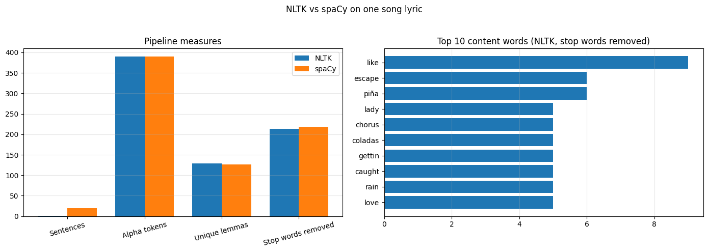
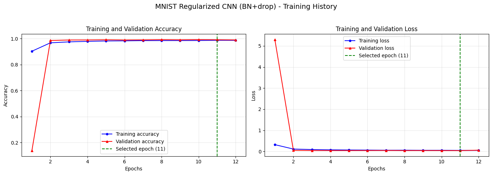
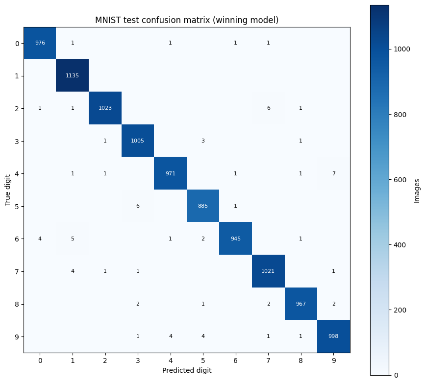

# Text Processing Fundamentals: Two Libraries, a Bag of Words, and a First CNN

Three small experiments on the mechanics underneath every NLP system. Part 1 runs NLTK and spaCy over the same 1,962-character song lyric and measures where their answers diverge. Part 2 builds a bag-of-words representation with a closed vocabulary and shows exactly what gets lost when new text arrives. Part 3 takes the classic Chollet MNIST CNN and asks a question the original version of this project skipped: does adding batch normalization and dropout actually help, measured under an identical protocol?

## Layout

```
projects/3/
├── part-1/    # NLTK vs spaCy preprocessing comparison (song.txt)
├── part-2/    # bag-of-words with an OOV token (two markdown documents)
├── part-3/    # MNIST CNN: book baseline vs regularized variant
└── archived/  # superseded originals (scripts and notebooks)
```

Each part is a standalone script that writes `part-N_output.txt` (full results, library versions) and its plots next to itself. The parts share no code on purpose; the three tasks have nothing real in common, and a forced shared module would be abstraction theater.

## How to run

```bash
python3.12 -m venv venv   # from the repo root; 3.12 for TensorFlow wheel support
./venv/bin/pip install nltk spacy scikit-learn tensorflow keras matplotlib
./venv/bin/python -m spacy download en_core_web_sm
./venv/bin/python projects/3/part-1/part-1.py   # fetches NLTK data on first run
./venv/bin/python projects/3/part-2/part-2.py
./venv/bin/python projects/3/part-3/part-3.py   # fetches MNIST on first run
```

Parts 1 and 2 are deterministic and finish in seconds; part 3 is seeded (42) and takes a minute or two.

## Part 1 — Where NLTK and spaCy disagree

Both libraries process the same lyrics through tokenization, lemmatization, stop-word removal, and POS tagging; NLTK adds Porter and Snowball stemming, spaCy adds named-entity recognition.

| Measure | NLTK | spaCy |
|---|---|---|
| Sentences detected | 1 | 20 |
| Alphabetic tokens | 390 | 390 |
| Unique lemmas | 129 | 127 |
| Stop-word tokens removed | 213 | 219 |
| Named entities | — | 17 |

The sentence row is the headline: lyrics have almost no terminal punctuation, so NLTK's punkt sees one giant sentence while spaCy's parser, using line breaks and syntax, finds 20. Any downstream step that works per sentence inherits that gap.

The per-word table shows why algorithm choice matters:

| Word | Porter | Snowball | NLTK lemma | spaCy lemma |
|---|---|---|---|---|
| caught | caught | caught | caught | **catch** |
| escape | escap | escap | escape | escape |
| lady | ladi | ladi | lady | lady |
| was | **wa** | was | be | be |

Porter happily produces non-words ("ladi", "wa"); the lemmatizers return dictionary forms, and spaCy's tagger wins on irregular verbs ("caught" → "catch") where NLTK's perceptron tagged the word as a noun. Overall lemma agreement is still 96% (130 of 135 shared words); the disagreements are almost all irregular forms.



## Part 2 — What a closed vocabulary throws away

A 620-entry 1-gram vocabulary is built from one research-paper text (2,113 tokens after POS-aware lemmatization), with index 0 reserved for `<OOV>`. A second, smaller abstract (258 tokens) is then encoded as `{vocabulary index: frequency}`.

The result: index 0 carries 145 of 258 token occurrences, spanning 107 distinct unseen words. Only 34.8% of the small text's unique lemmas exist in the vocabulary at all. The two questions the spec asks have one-line answers: the dictionary shows the new-word volume directly under index 0, and 0 is the key for every new word, which also means the model cannot tell those 107 words apart. That collapse is the cost of any closed vocabulary, and it is the same mechanism behind the OOV index in project 2's IMDB encoding; subword tokenizers exist precisely to soften it.

## Part 3 — Is the "enhanced" CNN actually better?

The original version of this part added batch normalization and dropout to the Chollet ch. 5.1 CNN without checking whether that helped. Here both architectures train under one protocol: seed 42, 54k/6k train/validation split, early stopping on validation loss, one test evaluation each.

| Model | Params | Best epoch | Val acc | Test acc | Fit (s) |
|---|---|---|---|---|---|
| Baseline CNN (ch. 5.1) | 93,322 | 4 | 0.9902 | 0.9896 | 17.6 |
| Regularized CNN (BN+dropout) | 93,962 | 11 | 0.9918 | **0.9926** | 49.5 |



The regularized variant wins by 0.30 points (74 errors vs 104 on the 10,000 test images) at three times the fit time and nearly three times the epochs. The confusion matrix shows the survivors are the classic lookalikes: 4→9, 2→7, 5→3.



The spec's shape question is answered from the live model rather than by hand: the first `Conv2D(32, (3, 3))` maps 28×28×1 to 26×26×32 because a 3×3 window at stride 1 with no padding fits (28−3)+1 = 26 positions per axis, once per filter.

## Findings

1. **Library defaults disagree on the basics, and it propagates.** One sentence vs twenty from the same text is not a rounding error; anything sentence-scoped downstream (summarization, alignment, chunking) inherits it.
2. **POS information beats algorithm choice for normalization quality.** The lemmatizers agree 96% of the time; the visible wins ("caught" → "catch", "was" → "be") come from better tagging, not better dictionaries. Stemming's speed buys non-words.
3. **A closed vocabulary silently discards most of an out-of-domain document.** 56% of the new text's tokens landed in one undifferentiated OOV bucket. Coverage, not model capacity, was the binding constraint, the same lesson project 2 found at 200 words.
4. **Measure the "enhancement."** Batch norm and dropout do beat the book CNN here, but by 0.30 points for 3× the training time, and that number comes from a single seeded run; calling it an improvement without the baseline row would have been an assumption, not a result.
5. **Why these preprocessing steps exist** (the spec's essay question, condensed): tokenization defines the units everything else counts; stemming trades linguistic correctness for recall and speed; lemmatization preserves dictionary meaning at the cost of needing POS context. Transformers move tokenization into learned subwords and contextual embeddings, which softens the OOV and normalization problems, but cost, interpretability, and small-corpus work keep the classical steps relevant.

## Limitations and next steps

Part 1 measures one tiny document, an anecdote rather than a benchmark; a real comparison would sweep genres and document lengths. Part 2 stops at raw frequencies where TF-IDF weighting, n-grams, or a subword vocabulary are the obvious next rungs. Part 3's 0.30-point gap rests on one seed; averaging over several seeds (and trying data augmentation) would be needed before trusting the ranking. All deliberately out of scope.

## Provenance

Part 3's baseline follows Chollet, *Deep Learning with Python*, ch. 5.1. Part 1 processes the lyrics in `song.txt`; part 2's documents are two research-paper texts in `part-2/`. Superseded originals, including the notebook versions, are kept under `archived/`.
