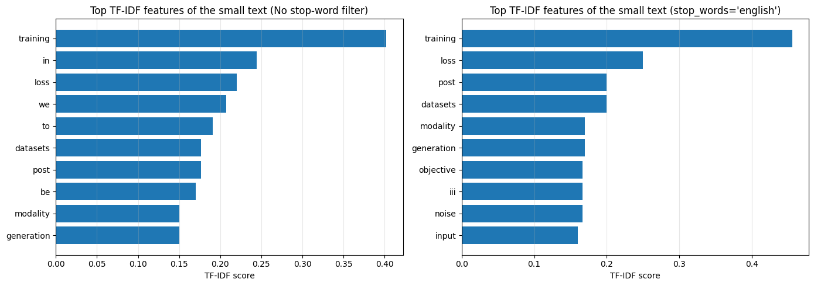
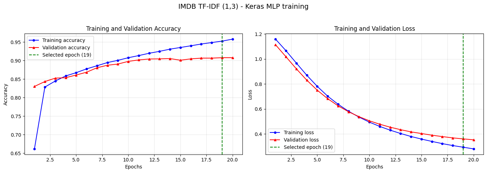
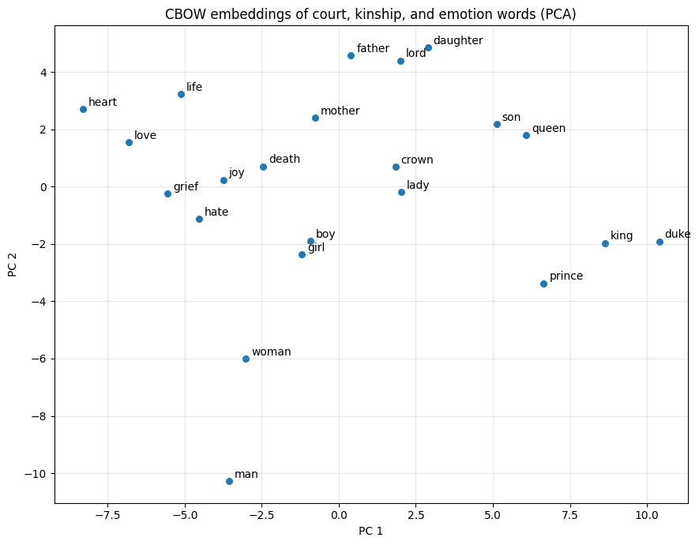

# TF-IDF Representations and Word Embeddings: Transfer, a 90% Target, and Shakespeare

Three experiments on pre-neural text representations. Part 1 dissects what actually moves when a TF-IDF vectorizer trained on one document is applied to another. Part 2 takes the spec's hard target, at least 0.90 test accuracy on IMDB with TF-IDF n-grams, which the original version of this project never reached (89.84% submitted, and a results file named `test_accuracy_90plus.txt` that contained 88.28%), and reaches it with data cleaning and a sound protocol rather than more tuning. Part 3 retrains word2vec on Shakespeare properly and turns nonsense neighbors into a coherent semantic geometry.

## Layout

```
projects/4/
├── part-1/    # TF-IDF vocabulary transfer (large.md -> small.md)
├── part-2/    # IMDB sentiment with TF-IDF n-grams, >= 0.90 target
├── part-3/    # word2vec on Shakespeare (data/shakespeare-complete-works.html)
└── archived/  # superseded originals (scripts, notebooks, tuning log)
```

Each part is a standalone script that writes `part-N_output.txt` (full results, library versions, seed) and its plots next to itself. The parts share no code on purpose; the three tasks have nothing real in common.

## How to run

```bash
python3.12 -m venv venv   # from the repo root; 3.12 for TensorFlow wheel support
./venv/bin/pip install nltk scikit-learn tensorflow keras matplotlib gensim beautifulsoup4 lxml
./venv/bin/python projects/4/part-1/part-1.py   # seconds, deterministic
./venv/bin/python projects/4/part-2/part-2.py   # ~2.5 minutes, seeded (42)
./venv/bin/python projects/4/part-3/part-3.py   # ~1 minute, seeded (42)
```

Part 3 re-executes itself once with `PYTHONHASHSEED=0` so gensim's vocabulary hashing is reproducible alongside `seed=42, workers=1`.

## Part 1 — What a fitted TF-IDF vectorizer actually transfers

Both research-paper texts go through the same NLTK pipeline (lowercase, alphabetic tokens, POS-aware WordNet lemmatization): 2,275 tokens / 603 unique lemmas for the large text, 300 / 170 for the small one. The large text is split into 23 hundred-token pseudo-documents, because IDF is a document-frequency statistic and a single document would make every IDF identical. The fitted vectorizer then encodes the small text: 500 columns, 107 non-zero, unit L2 norm.

Four things transfer with the vectorizer, and the script shows each: the vocabulary (the small text cannot add columns), the IDF weights (the large text decides what counts as distinctive), the preprocessing contract, and the L2 normalization. The new-word answer is measured, not asserted: 44 of the small text's 170 lemmas never occur in the large text, zero of them get a column, and `transform()` drops them with no error, warning, or OOV slot. Project 3 part 2 built the opposite design, an explicit OOV index that counted 145 such occurrences; sklearn's silence is the default most pipelines inherit without noticing.

One vectorization detail matters for the display: without stop-word filtering the top features of a 23-chunk corpus are `in`, `we`, `to`, because IDF barely deflates words that appear in every chunk. A `stop_words='english'` variant moves `loss`, `post`, `datasets` to the top. Same transfer mechanics, better demo.



## Part 2 — IMDB at 90.46%: hygiene and protocol, not more tuning

The original attacked this target with sixteen logged tuning runs (architecture width, dropout decimals, feature counts) and plateaued at 89.92%, submitting 89.84%. Its top TF-IDF feature was `br`, the residue of HTML `<br />` tags, and its model never saw 2,500 of the 25,000 training reviews because nothing was retrained after epoch selection on the 90/10 split.

This version keeps `imdb.load_data(num_words=10000)` exactly as the spec demands, decodes the sequences back to text, drops the pad/start/oov markers and `br`, and uses sublinear TF-IDF, 40k features, min_df=2, sparse end to end (a small `PyDataset` densifies CSR batches on the fly; the dense design matrix would be 4 GB). Everything is selected on a 2,500-review validation split; every candidate then refits on the full training set and touches the test set exactly once.

N-gram selection, C-tuned logistic regression on validation:

| n-grams | Features | Val acc |
|---|---|---|
| (1,1) | 9,765 | 0.8932 |
| (1,2) | 40,000 | 0.9068 |
| **(1,3)** | 40,000 | **0.9092** |

Model comparison on the chosen (1,3) representation:

| Model | Best epoch | Val acc | Test acc |
|---|---|---|---|
| Logistic regression (C=4) | — | 0.9092 | **0.9046** |
| Keras logistic (Dense 1, Adam) | 20 | 0.8916 | 0.8840 |
| Keras MLP 512 (dropout 0.45, L2) | 19 | 0.9076 | 0.9042 |



The winner on validation is the convex model, and its single test evaluation lands at **0.9046**: goal met, with the MLP also clearing 0.90 once it was refit on the full training set. The two-point gap between sklearn's LBFGS-optimized logistic regression and the identical model class trained with Adam for 20 epochs is the quiet lesson: optimization quality, not architecture, was the margin here.

The n-gram discussion the spec asks for is answered by the ablation: bigrams are the big step (+1.36 points over unigrams) because negation and intensity are two-word phenomena; trigrams add a small +0.24 at the same budget once min_df=2 filters the one-off phrases. The original concluded trigrams hurt; after removing `br` and letting a fully optimized classifier judge, the ordering reverses. Representation conclusions are pipeline-relative.

## Part 3 — word2vec that actually learned Shakespeare

The original trained CBOW on 20,000 of 78,984 sentences, license boilerplate included (its own sample tokens begin "the project gutenberg ebook of"), for 5 epochs. Its neighbors for `queen` were `hamlet`, `lancaster`, `westmoreland`, and the spec's analogy `boy + queen - king` answered `fie`.

This version cuts the Gutenberg header and footer, keeps all 77,523 sentences (957,851 tokens, 8,980-word vocabulary after min_count=5), and trains CBOW and skip-gram for 20 epochs each under one seed. The winner is chosen by two analogy probes, lower rank is better:

| Model | boy+queen−king | king−man+woman | Train time |
|---|---|---|---|
| **CBOW** | rank 9 (`girl`) | rank 1 (`queen`) | 9s |
| Skip-gram | rank 64 | rank 1 (`queen`) | 30s |

CBOW wins, against the textbook heuristic that skip-gram suits small corpora. Its neighbors are now coherent: `king` sits with `prince, duke, queen, dauphin, talbot`; `queen` with `princess, margaret, daughter, king, lady`; `love` with `hate, duty, kindness, respect, passion`; `death` with `life, shame, revenge, curse, murder` (antonyms sharing contexts is classic distributional behavior). The analogy's top ten are almost entirely feminine role words: `nurse, maid, wench, child, gentlewoman, creature, picture, babe, girl, aunt`. A sub-million-token corpus does not produce one confident `girl`, and the output says so; the honest deliverable is the ranked list plus the rank-1 sanity probe.



## Findings

1. **Hygiene beat tuning.** Removing one junk token (`br`), refitting on the full training set, and letting validation pick the representation delivered the 90% target that sixteen hyperparameter runs could not reach. The submitted-version ceiling was a data and protocol problem, not a capacity problem.
2. **The optimizer was the architecture.** The same linear model scored 0.9092 (LBFGS to convergence) and 0.8916 (Adam, 20 epochs) on validation; the 512-unit MLP bought nothing over the convex baseline. On 40k sparse TF-IDF features, model class matters less than solving the optimization well.
3. **Representation conclusions don't transfer between pipelines.** Trigrams hurt in the original and help after cleanup; skip-gram "should" win on a small corpus and lost both probes to CBOW. Both reversals were one cheap measured comparison away.
4. **For embeddings, the corpus was the hyperparameter.** Four times the sentences, boilerplate removed, and more epochs turned `fie` into a feminine-role cluster; vector size and window never changed.
5. **Silent OOV handling is a design choice you inherit.** sklearn zeroes unknown words without a trace (44 of 170 lemmas here); project 3's hand-rolled BoW counted them at an explicit index. Knowing which behavior your pipeline has is one measurement, and most pipelines skip it.

## Limitations and next steps

Everything rests on seed 42: the 0.24-point trigram edge and the logreg-vs-MLP gap are inside single-run noise for a 2,500-review validation split, so the honest claim is "no worse, slightly ahead", not a ranking. The embedding probes are two analogies, not a benchmark suite; a real evaluation would use a held-out analogy set. Part 1's chunking makes IDF well-defined but the chunk size is arbitrary. All deliberately out of scope.

## Provenance

Part 2 starts from the movie-review classification example in Chollet, *Deep Learning with Python* (the reference notebook is kept in `archived/`). Part 3's corpus is the Project Gutenberg HTML edition of Shakespeare's complete works in `part-3/data/`. Superseded originals, including the prior tuning log and notebooks, are in `archived/`.
