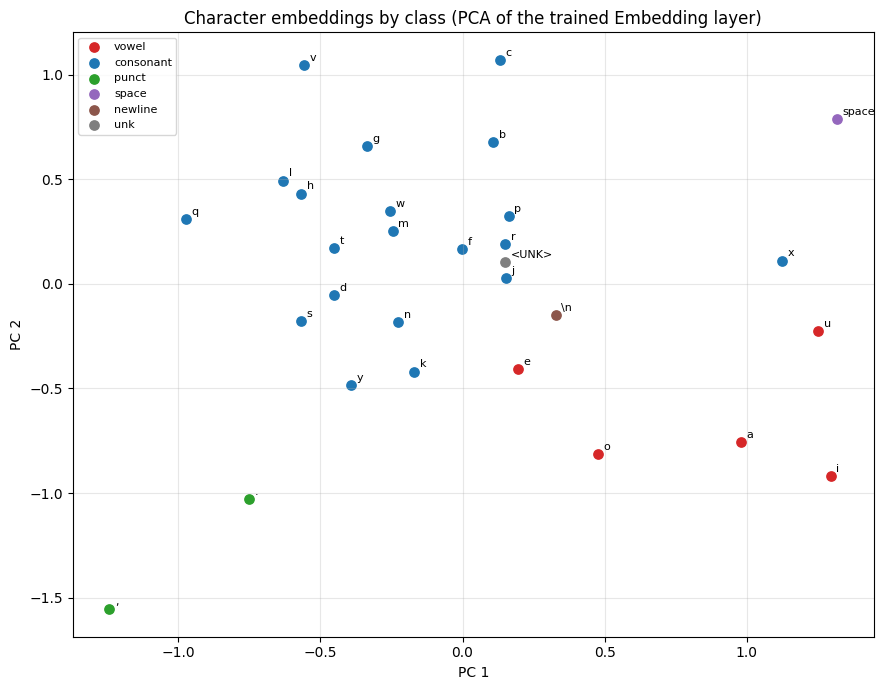
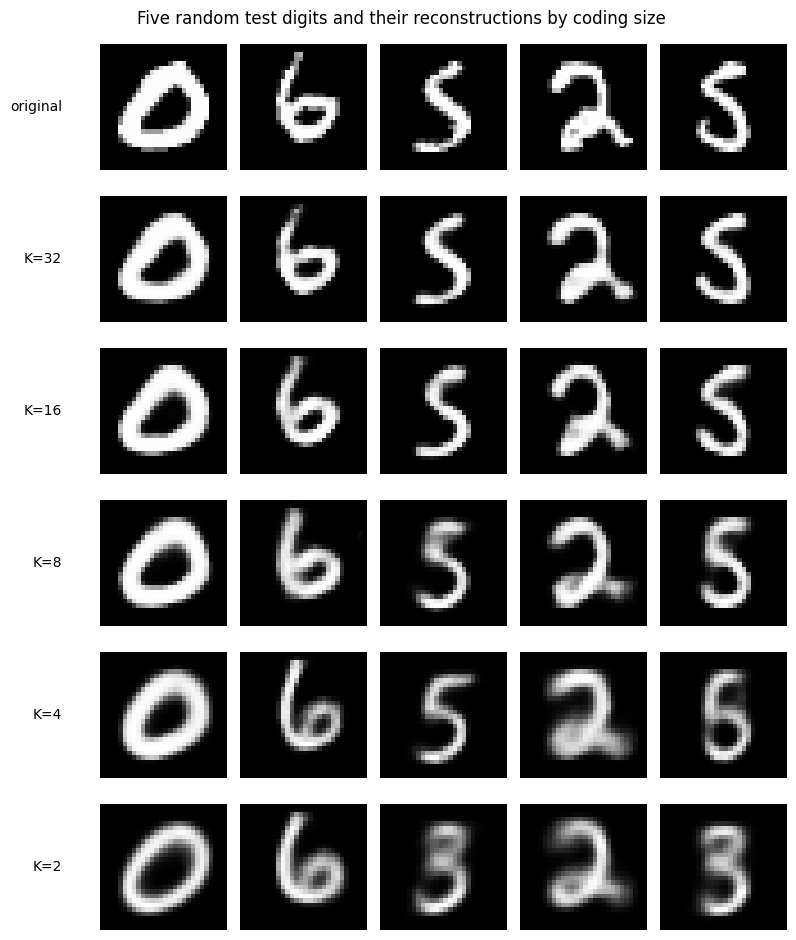
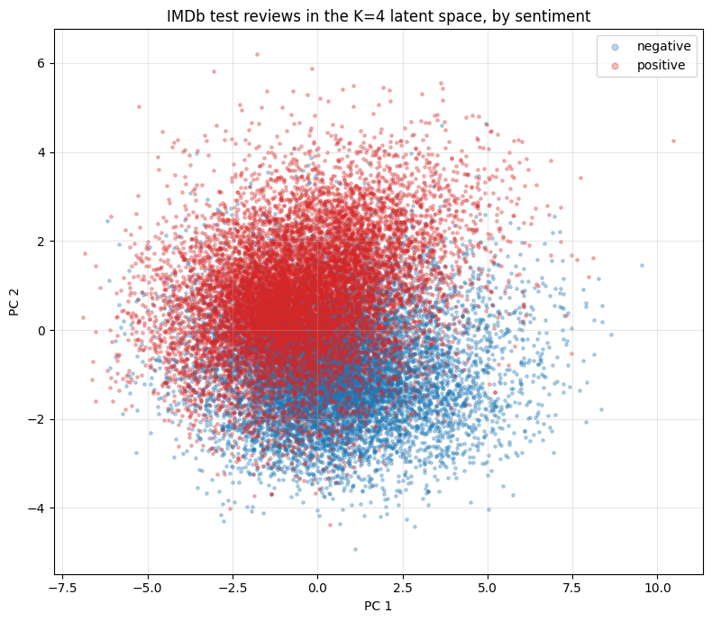
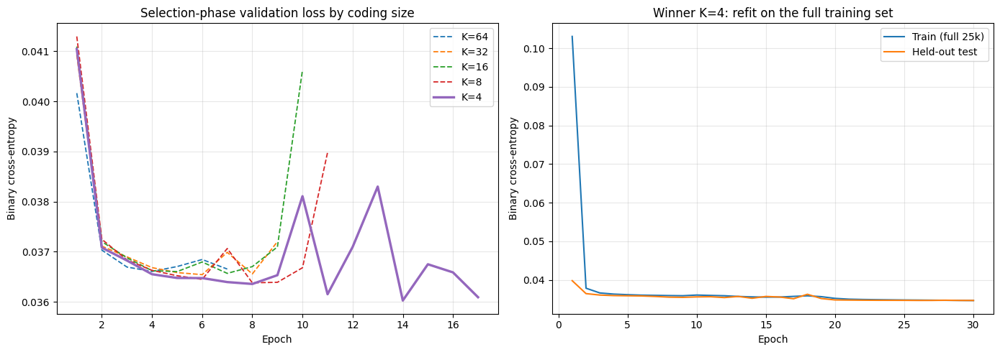

# Autoencoders and Embeddings: When the Metric Is the Bug

Three compression experiments on text and images, each rebuilt around the same
idea: the original versions did not fail at modeling, they failed at
measurement. Part 1 replaces asserted claims about a character embedding with
read-out geometry and a live library probe. Part 2 turns "still recognizable"
from an eyeball call into a classifier's verdict. Part 3 is the sharp one: the
prior version reported 99% accuracy and "semantic integrity preserved" for an
IMDb autoencoder, and shipped two different answers to the one question the
spec asked. Scored honestly, the reconstruction barely beats predicting the
corpus average, and what the bottleneck actually keeps is something else
entirely.

## Layout

```
projects/5/
├── part-1/    # character embeddings and transfer (large.txt -> small.txt)
├── part-2/    # MNIST undercomplete autoencoder, bottleneck chosen by a judge
├── part-3/    # IMDb bag-of-words autoencoder, scored against a baseline
└── archived/  # superseded originals (scripts, notebook, prior outputs)
```

Each part is a standalone script that writes `part-N_output.txt` (full results,
library versions, seed) and its plots next to itself. The parts share no code;
the three tasks have nothing real in common beyond the lesson about metrics.

## How to run

```bash
python3.12 -m venv venv   # from the repo root; 3.12 for TensorFlow wheel support
./venv/bin/pip install keras tensorflow scikit-learn matplotlib numpy
./venv/bin/python projects/5/part-1/part-1.py   # ~5 seconds, seeded (42)
./venv/bin/python projects/5/part-2/part-2.py   # ~2.5 minutes, seeded (42)
./venv/bin/python projects/5/part-3/part-3.py   # ~3.5 minutes, seeded (42)
```

Every script calls `keras.utils.set_random_seed(42)`; selection happens on a
validation split and the test set is touched once.

## Part 1 — A character embedding, measured instead of described

Both texts (a page of deep-sea prose, a short field-log snippet) are lowercased
and mapped to integers off a 30-symbol vocabulary built from the large text
alone, with `<UNK>` reserved at index 0. A next-character model (Embedding ->
Flatten -> Dense -> softmax) trains on 5,192 eight-character windows and reaches
0.356 validation accuracy against a 0.182 majority baseline, enough to say the
24-dimensional vectors carry real sequential structure rather than noise.

The transfer story is then read off the trained matrix, not asserted. Two
things move to the small text: the shared vocabulary (the small text cannot add
a column) and the geometry. Measured, the geometry groups characters of a kind:
within-vowel mean cosine is +0.18 against −0.05 vowel-to-consonant, a +0.23 gap,
and the PCA below shows vowels, consonants, and punctuation in separate regions.



The out-of-vocabulary answer is the part the original got vague about. It
claimed `<UNK>` was a Keras default; it is not. Probed against the live layer in
the run, `keras.layers.Embedding` raises `InvalidArgumentError` on an index one
past the vocabulary: no OOV slot, no quiet fallback. Twenty of the small text's
symbols (`# $ @ % &`, digits, and more, 12.2% of its characters) are new, and
they survive only because reserving index 0 is *our* design. For contrast,
`keras.layers.TextVectorization` does reserve slots by default (0 padding, 1
`[UNK]`). Different layer, different contract; the lookup itself forgives
nothing.

## Part 2 — Making "recognizable" a number

The spec asks for the smallest bottleneck whose reconstructions stay
recognizable. The original answered by describing blurriness in prose. This
version hands the call to an independent digit classifier (the judge, 0.979 on
clean test pixels): a coding size is "recognizable" if the judge still reads its
reconstructed validation digits correctly at least 90% of the time.

| Codings K | Compression | Val BCE | Judge acc (val) |
|---|---|---|---|
| 32 | 24:1 | 0.0784 | 0.9817 |
| 16 | 49:1 | 0.0910 | 0.9697 |
| 8 | 98:1 | 0.1110 | 0.9525 |
| **4** | **196:1** | 0.1419 | **0.9113** |
| 2 | 392:1 | 0.1715 | 0.7672 |

Reconstruction loss falls smoothly with K and never names a floor; the judge
does. K=4 holds at 0.911 and K=2 falls off a cliff to 0.767, the boundary the
eye reported inconsistently before. The single test evaluation for K=4 lands at
judge accuracy 0.895 (versus the 0.911 it earned on validation, an honest
validation-to-test slip) against the 0.979 clean ceiling. The reconstructions
make the cliff visible: at K=4 every digit is still itself; at K=2 the fives
collapse into threes.



The measured answer, 4 codings, matches what the original guessed. The
difference is that it is now a number with a located failure point, not a
description.

## Part 3 — The metric was the bug

The prior version multi-hot-encoded reviews over 10,000 words, autoencoded them,
and reported 99.13% accuracy with "semantic integrity preserved". It also
shipped two answers to the spec's one question: the notebook said 16 codings,
the fix script said 4. Both numbers came from a metric that could not tell them
apart. These bag-of-words vectors are ~99% zeros, so predicting all zeros scores
0.99 by itself, and the reported word overlap counted padding, start, and
out-of-vocabulary markers plus the handful of words every review shares.

This version removes all of that. Markers are dropped from the vocabulary, and
reconstruction is scored as top-m word recall (for a review with m words, take
the model's m highest-probability words, measure overlap) against two baselines:
a global-frequency predictor that ignores the input entirely, and the same
metric with the 50 commonest words excluded so only content words count.

| Codings K | Val BCE | Recall | Content recall | Sentiment probe |
|---|---|---|---|---|
| 64 | 0.0366 | 0.380 | 0.195 | 0.661 |
| 32 | 0.0365 | 0.379 | 0.195 | 0.703 |
| 16 | 0.0366 | 0.380 | 0.196 | 0.691 |
| 8 | 0.0364 | 0.382 | 0.198 | 0.707 |
| **4** | 0.0360 | 0.386 | **0.204** | 0.716 |

The global-frequency baseline scores recall 0.379 and content recall 0.194. The
autoencoder, at every K from 64 down to 4, sits right on top of it. On the test
set the winner gains +0.011 recall and +0.016 content recall over baseline:
real, but tiny. The five sample reconstructions say the same thing in words,
every review decodes to nearly the same list of common terms, because a small
bottleneck on sparse bag-of-words mostly learns the corpus average.

What the code does keep is the dominant low-dimensional axis. A linear probe
reads review sentiment out of just 4 latent numbers at 0.776 (chance 0.500), and
the test reviews separate by sentiment in the latent space:



So the honest answer to "smallest number of codings" is 4, but for the opposite
reason the original implied. Not because 4 dimensions preserve the reviews, they
do not; word reconstruction is near-baseline at every size tested, so nothing
larger earns its codings. Four is the floor because it already captures the one
thing about a review that survives this much compression: whether it is
positive or negative.



## Findings

1. **The metric was the bug, not the model.** Part 3's 99% accuracy was the
   sparsity of the data, not the quality of the reconstruction. A baseline-
   relative content metric shows the autoencoder recovers almost no review-
   specific words at any bottleneck size. Reporting against a do-nothing
   baseline is what turned a flattering number into an honest one.
2. **A subjective call becomes a measurement when you hand it to a model.**
   Part 2's "still recognizable" is a classifier's accuracy on reconstructions,
   which both confirms the bottleneck (K=4) and locates the cliff (K=2), neither
   of which prose could pin down.
3. **Probe the library, do not quote it.** Part 1's OOV behavior is a live
   `InvalidArgumentError` from the actual Embedding layer, correcting the
   original's claim that `<UNK>` was a Keras default. The reserved slot is a
   design decision, and the run proves the layer offers none on its own.
4. **What survives compression is the dominant axis, not the vocabulary.** Four
   IMDb codings lose the words but keep the sentiment at 0.776. Undercomplete
   autoencoders compress toward the few directions that explain the most
   variance, and on these reviews that direction is polarity.
5. **Two answers to one question means the question was never measured.** The
   original gave 16 and 4 codings for the same task because its metric could not
   separate them. One validation protocol, scored honestly, gives one answer.

## Limitations

Everything rests on seed 42; the part-3 gains over baseline (+0.01 to +0.02) are
small enough that the cross-K ordering is within run-to-run noise, which is
itself the point (no size reconstructs meaningfully better). Part 1's corpus is
deliberately tiny, so its embedding geometry is suggestive, not a trained
production vector space. The part-2 recognizability threshold (0.90) and the
part-3 content cutoff (top-50 words) are stated choices, not derived constants.
A fuller study would average over seeds and sweep those thresholds; all out of
scope here.

## Provenance

The IMDb autoencoder in part 3 follows the bag-of-words dense-autoencoder setup
that produced this repo's standard training defaults (linear bottleneck, binary
cross-entropy, dropout 0.1, Adam 1e-3). The superseded scripts, the combined
notebook, and the prior outputs are in `archived/`.
